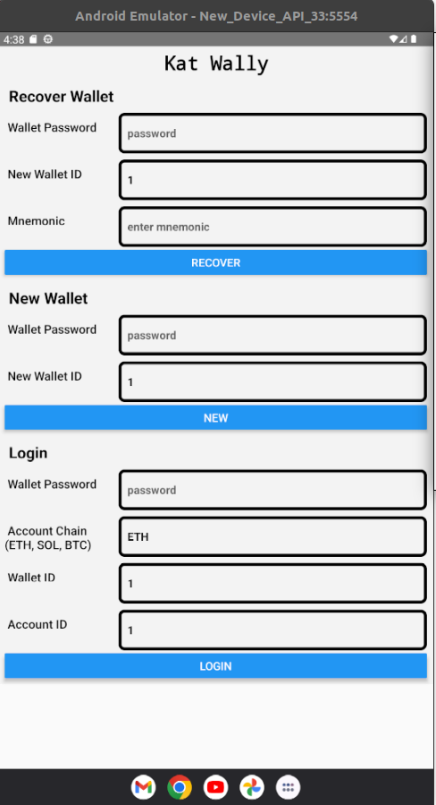
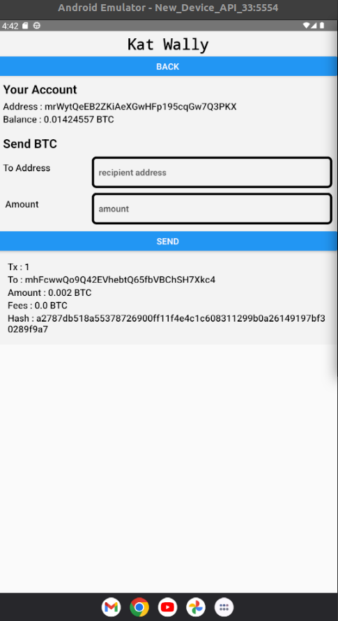

# Kat Wally

Kat Wally is a mobile wallet that allows users to create new accounts and transfer assets (ETH, BTC, SOL) to other accounts.

## Features

1. Supports creation of multiple HD Wallets (use wallet id to access the multiple wallets)
2. Has secure persistence on device, it persists the hd wallet in the device and encrypts it with a user provied password.
3. Supports creation of multiple accounts for a particular HD Wallet.
4. Also supports recovering HD wallet if mnemonic is provided.
5. Supports Ethereum, Solana and Bitcoin testnet transfers.

## Screenshots

1. Home Screen

2. Account Page

